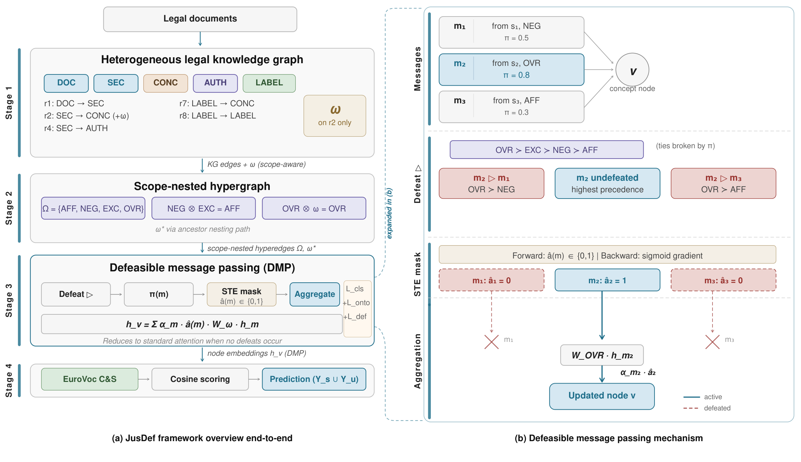
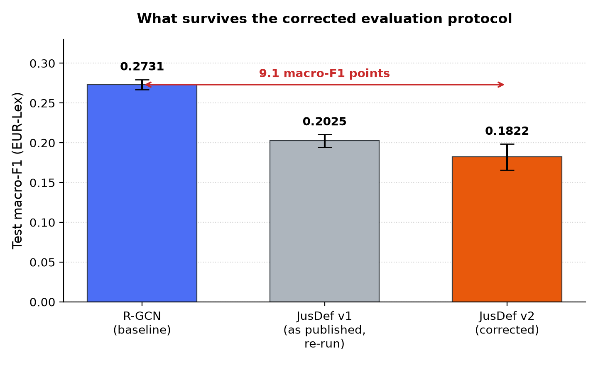
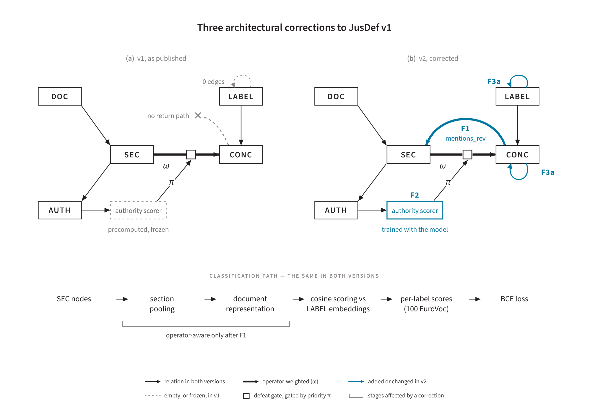

# JusDef — v1 workshop code (archived)

> **This repository is superseded. Active work is at
> [`oziofficial5/jusdefv2`](https://github.com/oziofficial5/jusdefv2).**
>
> Everything released with the doctoral thesis — the corpus, the trained
> detector, the full experimental code, and the per-seed logs backing every
> reported number — lives there. This repository is kept for provenance only.

---

## What this is

The original implementation of **JusDef v1**, the architecture reported in the
ANNPR 2026 workshop paper:

> Khaliq, A. A., Montanelli, S., Dalianis, H., Naqvi, N. (2026). *JusDef:
> Defeasible Message Passing for Exception-Aware Legal Document
> Classification.* Artificial Neural Networks in Pattern Recognition, 12th IAPR
> TC3 Workshop, ANNPR 2026. Lecture Notes in Artificial Intelligence, Springer
> Nature Switzerland.
> [doi:10.1007/978-3-032-39028-8_6](https://doi.org/10.1007/978-3-032-39028-8_6)

JusDef v1 is a heterogeneous graph neural network over legal documents. Sections,
concepts, authorities and labels are typed nodes; each operator occurrence is a
typed edge carrying one of four labels (AFF, NEG, EXC, OVR). A **Defeasible
Message Passing** layer lets messages defeat one another under a priority order
drawn from defeasible reasoning theory, using a hard binary defeat gate trained
through a straight-through estimator.



*The framework as published, end to end (a), with the defeasible message-passing
step expanded (b). Two things in this diagram are worth flagging to anyone
reading the paper alongside the code. Stage 2 is the scope-nested hypergraph
construction, which the thesis does not carry forward: there the operator
composition acts earlier, at detection time, under an outermost-wins rule, and
no hypergraph is built at inference. And the LABEL → LABEL relation drawn in
Stage 1 was declared but never populated — an empty relation, which is the
defect correction F3a later repairs.*

```
src/model/
  jusdef.py            the v1 model
  dmp_layer.py         Defeasible Message Passing, hard defeat gate + STE
  authority_scorer.py  scalar authority priority on each mention edge
  baselines.py         R-GCN baseline
```

---

## Why it is archived, and what happened to the result

The workshop paper reports a gain for the hard-defeat architecture on an
exception-dependent label subset. **That evaluation tuned its decision threshold
on test labels.**

The v1 evaluation script selects the classification threshold by sweeping a grid
and keeping whichever value maximises macro-F1 *on the split being evaluated*. It
was called on the test split with the test labels in scope, so the threshold was
fitted to the test set rather than to validation. The resulting optimistic bias
is on the order of 1–3 macro-F1 points.

The discrepancy is between the code and the paper, not inside the paper. The
workshop text states the correct protocol — "a global decision threshold is tuned
on validation Macro-F1 and fixed at test time" — and it is the released
evaluation script that departed from it.

Under the corrected protocol the reported advantage is not reproduced, and the
bug accounts for only part of that. Re-run with the threshold frozen on
validation, v1 sits **7.1** macro-F1 points below the R-GCN baseline it was built
to extend; the corrected v2 architecture sits **9.1** points below it.



*EUR-Lex test macro-F1, three-seed mean ± standard deviation, seeds 42–44, all
three arms under the corrected evaluation protocol. The R-GCN mean of 0.2731
matches the workshop paper's own reported baseline of 0.274 to within rounding,
which confirms the corrected protocol does not silently move the baseline.*

An audit also found three architectural defects in v1, each of which kept the
intended operator propagation from actually happening:

| | Defect | Consequence |
|---|---|---|
| **F1** | No reverse `mentions` edge | Operator-aware updates computed at concept nodes never propagate back to the section nodes that feed document classification |
| **F2** | Authority scorer outside the gradient path | It runs in preprocessing, so its parameters receive no gradient. The priority gating every mention edge comes from an untrained network |
| **F3a** | `parent_of` label relation declared but empty | The EuroVoc hierarchy was never populated, so hierarchy-aware aggregation between related labels does not occur |



*The three corrections against the v1 graph they repair. Node placement is
identical across the two panels, so every visible difference is a correction.
F3a is tagged twice because it populates two relations. Everything unmarked —
including the operator-indexed weight matrices, the defeat gate and the
attention aggregation — is inherited from v1 unchanged.*

F2 bears directly on an empirical claim of the paper. The −Authority ablation
removes the scorer and substitutes raw authority features, and the paper reads
the resulting drop as evidence that "the learned authority weights contribute an
inductive bias". Those weights were never learned. The ablation compared a fixed,
randomly initialised projection against the raw features. A random projection can
still help, by spreading otherwise tied priorities and changing which edges
survive the group-maximum comparison, but that is a property of the projection
and not of trained authority. **The claim should be read as unsupported in the
form the paper states it.**

Applying all three corrections did not rescue the architecture. Correcting the
protocol does not close the gap either, which falsifies the threshold bug as its
principal cause. The thesis reports that correction in full, diagnoses the
shortfall through a hypothesis-falsification chain over five candidate
explanations, and redesigns the aggregation layer in response. None of that work
is in this repository.

This is recorded here rather than quietly dropped, because anyone finding this
code from the ANNPR paper should know the status of the number it reports.

---

## Where to go instead

| You want | Go to |
|---|---|
| The corpus, guidelines and IAA files | [`jusdefv2/data/annotations/`](https://github.com/oziofficial5/jusdefv2/tree/thesis-main/data/annotations) |
| The operator detector (code + training script) | [`jusdefv2/scripts/train_operator_detector.py`](https://github.com/oziofficial5/jusdefv2/blob/thesis-main/scripts/train_operator_detector.py) |
| The corrected architectures (JusDef-SP, JusDef-RR) | [`jusdefv2/src/model/`](https://github.com/oziofficial5/jusdefv2/tree/thesis-main/src/model) |
| The three-arm permutation control | [`jusdefv2`](https://github.com/oziofficial5/jusdefv2#the-permutation-control) |
| Per-seed logs for every reported number | [`jusdefv2/outputs/logs/`](https://github.com/oziofficial5/jusdefv2/tree/thesis-main/outputs/logs) |

---

## Contact

Awais Abdul Khaliq, Dipartimento di Informatica "Giovanni Degli Antoni",
Università degli Studi di Milano.
ORCID [0000-0002-3439-6256](https://orcid.org/0000-0002-3439-6256)
